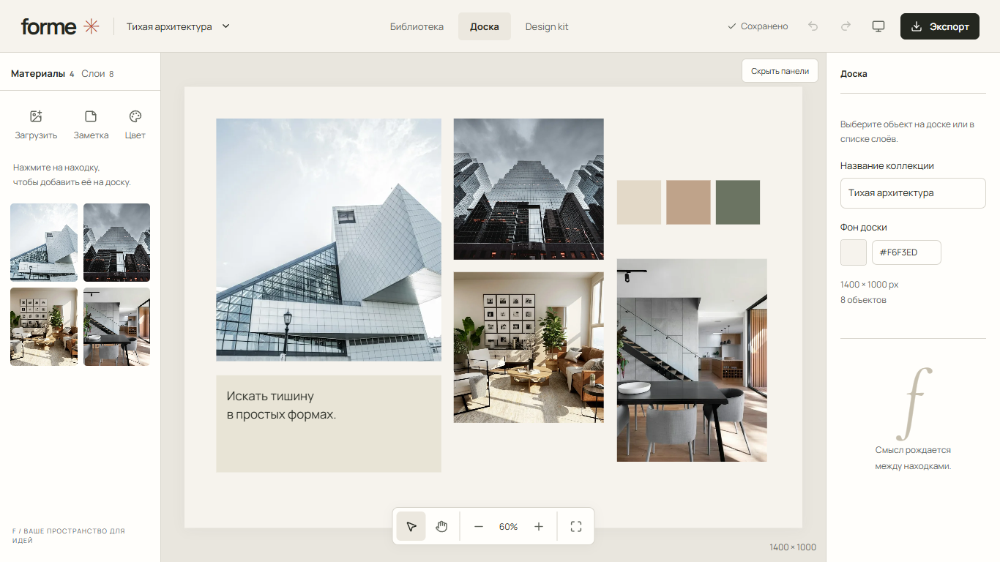
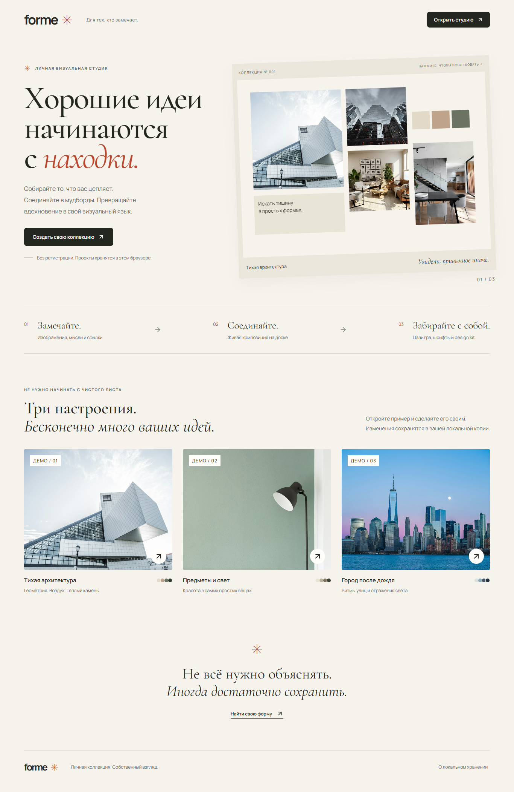
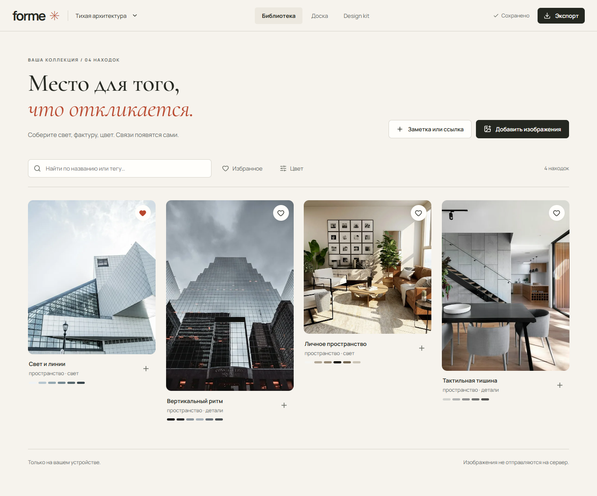
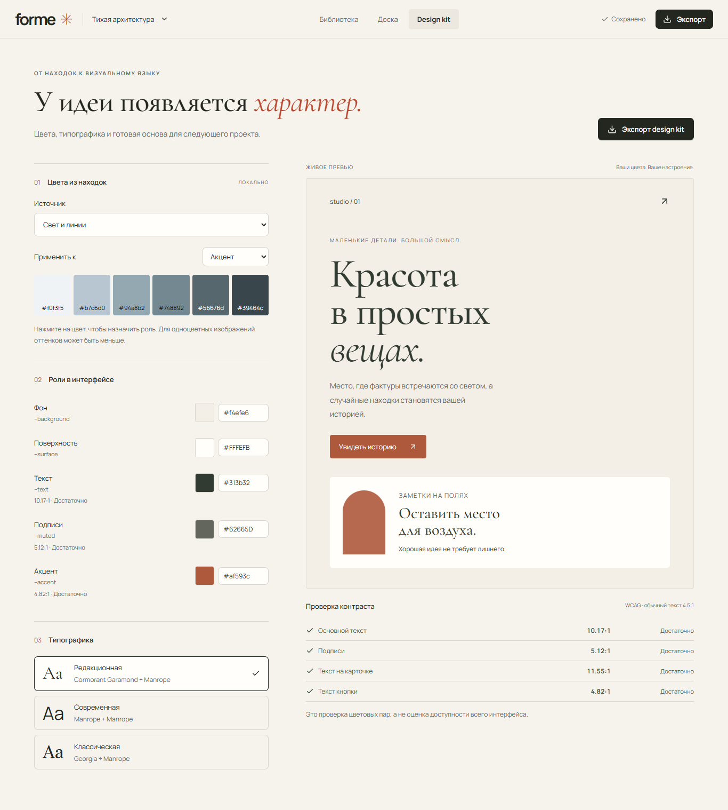

# FORME

**Local-first visual research studio.** Turn references into editable moodboards and reusable design kits.

A quiet space for collecting images, composing a direction, and taking it into the next project. No account, backend, analytics, or image uploads to a server. The interface is in Russian.



## From a reference to a direction

**References → moodboard → design kit → export**

1. Open a sample collection or create your own. Import JPEG, PNG, or WebP images; add notes, links, tags, and favorites.
2. Add materials to the board. Move, resize, layer, duplicate, and annotate them. Undo and redo composition changes.
3. Wait for the saved indicator, then reload: the document and original images remain in this browser.
4. Extract a palette, assign interface color roles, choose a font pairing, and inspect contrast in a live preview.
5. Download the board as PNG, a design kit ZIP, or a full `.forme` archive that restores an editable copy in another browser.

<details>
<summary><strong>Explore the screens: landing, library, and design kit</strong></summary>

### A place to begin



### Your reference library



### A reusable visual language



</details>

## Engineering highlights

- **Local-first persistence.** Native IndexedDB stores documents and image blobs. Uploads enter a durable queue before decoding. “Saved” follows transaction completion; failed writes remain visible and allow a recovery export.
- **Multi-tab consistency.** Web Locks grant one editing session per project. Revision checks also reject stale writes. Conflicting changes are preserved for export instead of silently overwriting newer data.
- **Undo/redo.** An 80-step metadata history avoids copying image buffers. Pointer gestures commit once at completion. History is session-local; reload restores the latest saved document.
- **Portable project format.** A `.forme` file is a versioned ZIP STORE archive containing the manifest and original images. Import validates the whole payload before a transaction and assigns new project/image IDs.
- **Hostile-import validation.** ZIP headers, paths, counts, declared sizes, CRC, document schema, and image ownership are checked. Compressed, encrypted, ZIP64, SVG, and HTML payloads are rejected. Raster signatures and pixel limits are checked before decoding.
- **Real exports.** Canvas2D renders a 1400 × 1000 PNG from the complete composition and original images. The design kit includes `tokens.json`, `theme.css`, and `DESIGN.md`; font files are not bundled.
- **Regression coverage.** Tests exercise persistence after reload, write failures, undo/redo, multi-tab conflicts, malicious archives, image-byte integrity, and restoration in a clean browser context.

## Architecture

React 19 · TypeScript · Vite · native IndexedDB/Web Locks · Web Worker/OffscreenCanvas · Canvas2D · JSZip · Lucide · authored CSS.

| Module | Responsibility |
| --- | --- |
| `model.ts` | Document schema, validation, commands, history, contrast, tokens |
| `storage.ts` | IndexedDB transactions, upload queue, revisions, editing sessions |
| `image.worker.ts` | Raster validation, thumbnails, deterministic palette extraction |
| `Board.tsx` / `Editor.tsx` | Accessible DOM objects, pointer gestures, properties, layers |
| `Library.tsx` / `Kit.tsx` | Reference collection and visual direction |
| `exports.ts` | Canvas rendering and portable archive import/export |

The interactive board uses DOM elements for focus and accessible names; export has a separate Canvas2D renderer. The document model is independent of both. Hash-based routes work on static hosting without a server router.

## Run locally

Requires Node.js 24 and npm. Dependencies are pinned in the lockfile.

```sh
git clone https://github.com/seoshiro/forme-studio.git
cd forme-studio
npm ci
npm run dev
```

Open the local address printed by Vite (port 5180). For a production build, run `npm run build`, then `npm run preview`. No environment variables are required. The Vercel configuration builds with `npm ci` / `npm run build` and serves `dist`.

## Testing

```sh
npm run lint
npm run typecheck
npm test
npm run build
npm run preview
# In a second terminal, with Google Chrome installed:
npm run test:e2e
node scripts/verify-artifacts.mjs
```

The release baseline passed 8 unit tests and 32 Playwright tests against the production build, including axe checks across landing, library, editor, and kit at 390, 768, 1366, and 1920 px. Export verification checks PNG dimensions and original/restored image hashes. An isolated `npm ci` build and Chromium/Firefox workflow smoke also passed. These are observed release checks, not a claim of universal browser or accessibility conformance.

WebKit launch was blocked by missing native libraries in the Windows test environment. Physical-device and screen-reader testing remain unverified. A supplemental compact-viewport check found undersized palette swatches at 683 × 384; core four-width axe checks were clean.

## Limits and data ownership

- Projects belong to the **current browser profile and origin**. Clearing site data can remove them. Export `.forme` backups regularly; there is no cloud sync or guaranteed offline app launch.
- The board is fixed at 1400 × 1000. Limits: 300 materials, 500 objects, 10 MiB / 40 megapixels per image, and 200 MiB archive contents. Only FORME v1 ZIP STORE archives are supported.
- Resize uses cover cropping. Rotation, freeform crop, multi-select, and an infinite canvas are not implemented.
- Original blobs needed by undo history are retained while tabs are active. Without Web Locks, orphan cleanup is deferred to protect another tab's history, so storage can grow.
- Exported color contrast is advisory; it does not certify the accessibility of a future design. The preview is a specimen, not a generated website.

Potential next steps: direct Safari/device validation, explicit storage-usage controls, and better composition tools such as multi-selection. No cloud infrastructure is required for the current workflow.

## License and assets

Application code: [MIT](LICENSE). Demo photos and fonts retain their own licenses; see [asset provenance and notices](ASSETS.md). Demo collections are fictional, not client work. No user uploads are included in this repository.
