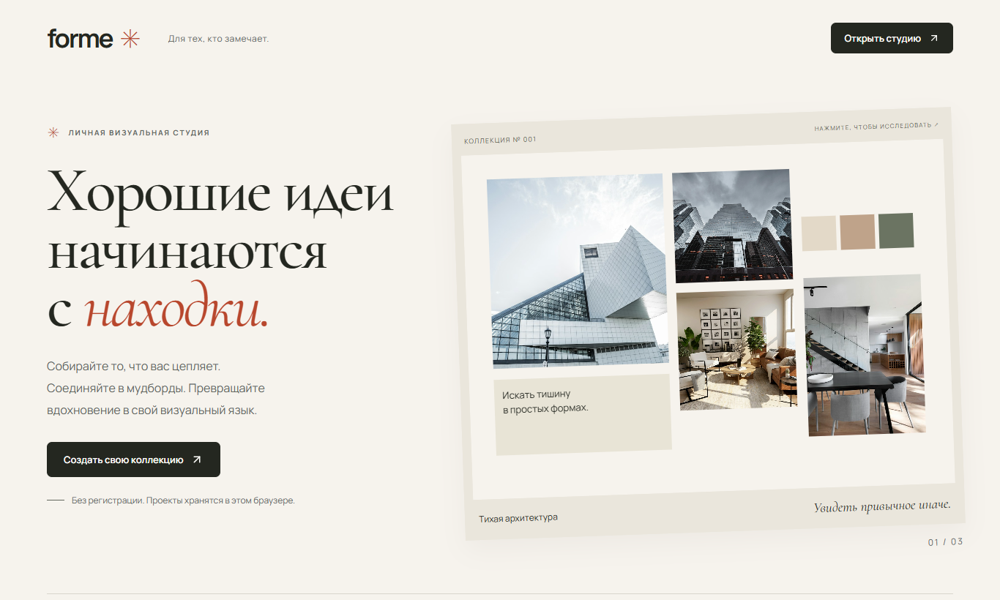
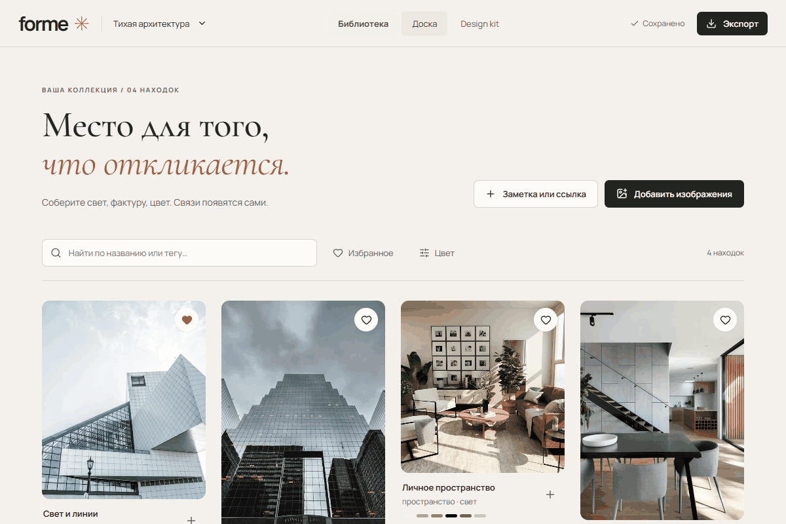
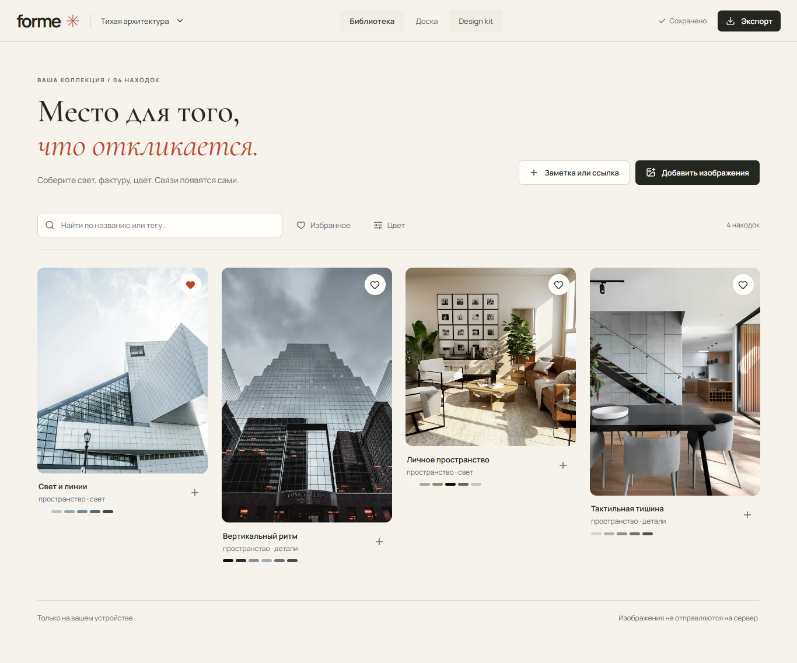
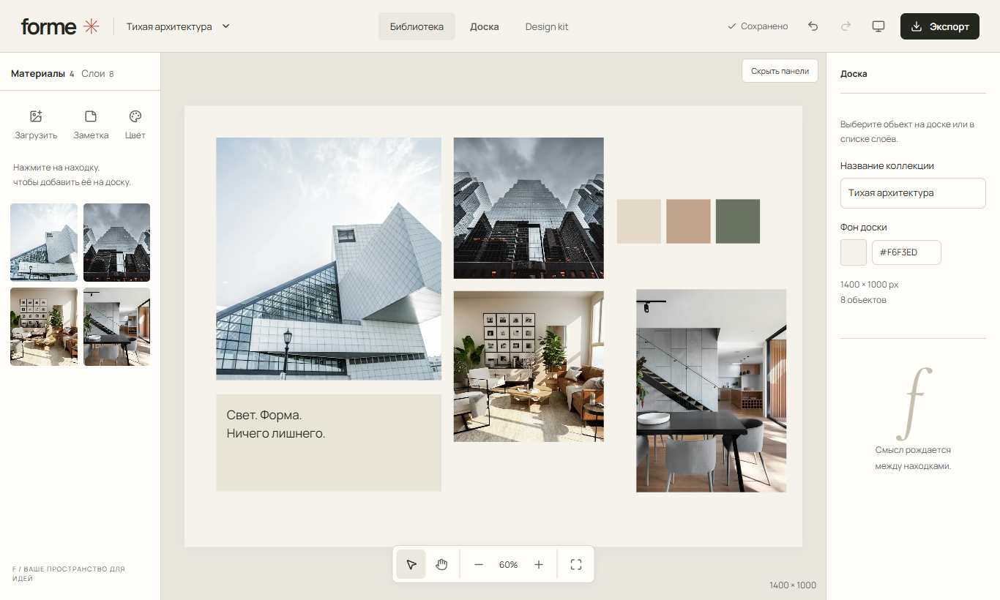
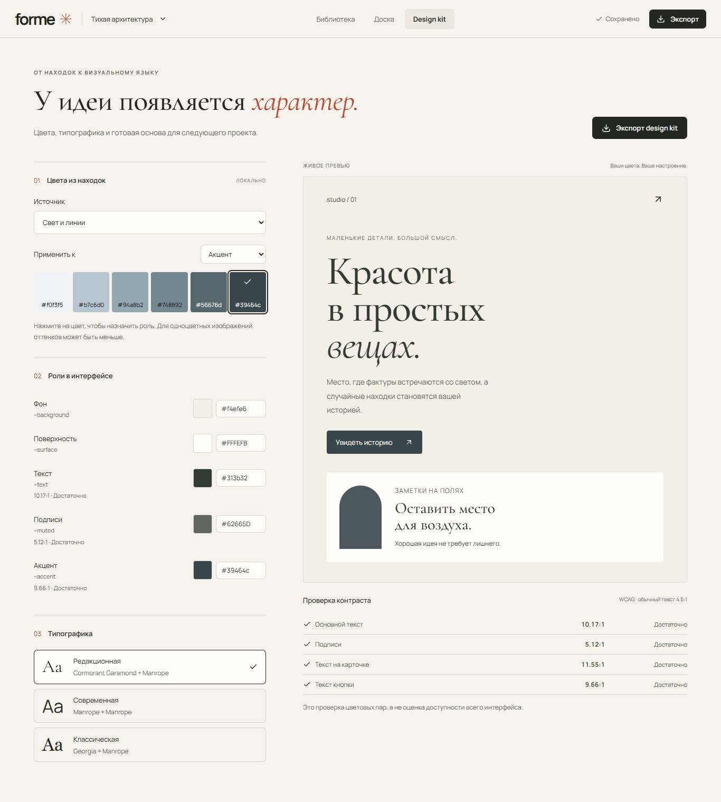
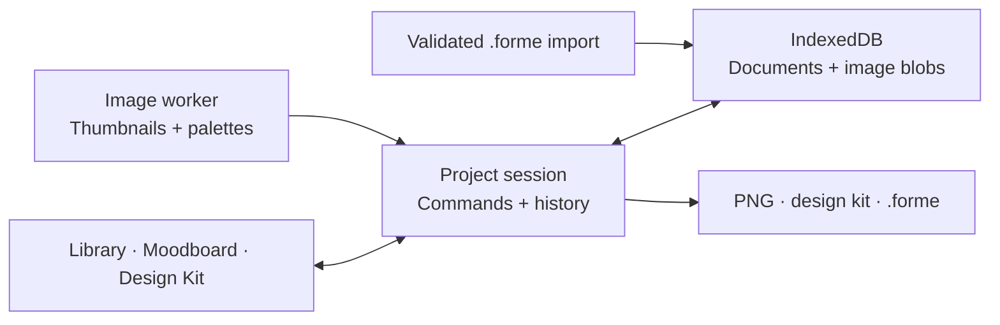

<div align="center">

# FORME

### Visual Research & Direction Studio

Turn visual references into editable moodboards and reusable design kits.

**[Live Demo ↗](https://forme-studio-coral.vercel.app/)** · [Features](#features) · [Engineering](#engineering-highlights)

</div>



### A direction, in motion

Library → compose → edit a note → choose an accent → export a design kit.



## What is FORME?

FORME is a local-first visual research studio for turning scattered references into a clear creative direction. Collect what catches your eye, find the composition, then take its colors and typography into your next project.

**References → Moodboard → Design Kit → Export**

No account or backend. Your images stay in your browser. The interface is in Russian; open **«Тихая архитектура»** in the demo to explore a ready-made collection.

## Features

- **A visual library.** Import JPEG, PNG, and WebP; collect notes and links; organize with tags, favorites, and search.
- **An editable moodboard.** Move, resize, layer, and duplicate images, notes, and swatches on a persistent board.
- **A design kit.** Extract palettes, assign semantic color roles, choose a font pairing, and inspect contrast in a live specimen.
- **Reliable editing.** Undo/redo, autosave, visible write errors, and recovery options when tabs conflict.
- **Portable projects.** Save a complete `.forme` archive, including original images, and restore an editable copy in another browser.
- **Useful outputs.** Export a 1400 × 1000 PNG or a kit containing design tokens, CSS variables, and a design guide.

## Product

### Collect



Keep the image, its context, and the colors that made you stop.

### Compose



Arrange references into a direction. Add a note to make the intent explicit.

### Translate into a system



Give colors a job: background, surface, text, muted text, or accent. Preview the result before exporting.

## Engineering highlights

- **Persistence you can see.** IndexedDB stores documents and original blobs; “Saved” appears only after the transaction commits. Uploads enter a durable queue before decoding.
- **Multi-tab consistency.** Web Locks coordinate editors and revision checks reject stale writes. Conflicts preserve changes for recovery export.
- **Bounded history.** An 80-step metadata history avoids copying image buffers. Each pointer gesture commits once, on completion.
- **Untrusted archive handling.** Import validates ZIP structure, paths, sizes, CRC, document schema, and image ownership before accepting a project.
- **Portable data.** Versioned `.forme` archives preserve original image bytes; restoration creates new IDs. Tests verify the round trip in a clean browser context.
- **Independent PNG rendering.** The editor uses focusable DOM objects; Canvas2D renders the complete composition from document geometry and original images.

### Architecture



One document model connects the three workspaces. Hash-based routes run on static hosting; image processing and storage stay in the browser.

## Quality

The release baseline passed **8 unit tests and 32 Playwright tests**, plus lint, typecheck, production build, and clean `npm ci` reproduction. [CI runs →](https://github.com/seoshiro/forme-studio/actions)

Chrome checks cover four screens at **390 / 768 / 1366 / 1920 px**, including axe scans. Separate Chromium and Firefox workflow smoke tests passed. Regression coverage includes failed writes, hostile imports, PNG output, and archive restoration with image-byte comparisons.

**WebKit: BLOCKED** by missing native libraries in the Windows test environment. Physical-device and screen-reader checks remain unverified. [Check scope, known gaps, and reproduction commands →](docs/ENGINEERING.md)

## Design

Warm paper tones, editorial type, and generous space put references ahead of navigation. Manrope provides structure; Cormorant Garamond brings a quieter, expressive voice.

The original brief selected mymind's editorial direction through Refero as inspiration. FORME follows that saved direction with its own layout and identity; live Refero access was unavailable. No affiliation with mymind or Refero.

## Built with

React 19 · TypeScript · Vite · native IndexedDB & Web Locks · Web Worker & OffscreenCanvas · Canvas2D · JSZip · Lucide · authored CSS · Playwright.

## Quick start

Node.js **24** and npm. No environment variables required.

```sh
git clone https://github.com/seoshiro/forme-studio.git
cd forme-studio
npm ci
npm run dev
```

For the production build:

```sh
npm run build
npm run preview
```

<details>
<summary>Source map</summary>

```text
src/App.tsx                    Routes and project lifecycle
src/Library.tsx                Reference collection
src/Board.tsx · Editor.tsx     Composition and editing controls
src/Kit.tsx                    Semantic colors and typography
src/model.ts · storage.ts      Document, history, persistence
src/image.worker.ts            Image processing and palettes
src/exports.ts                 PNG, design kit, archive import/export
tests/                         Model and browser regressions
docs/                          Engineering notes and product media
```

</details>

## Limits

- Data belongs to the current browser profile and origin. Clearing site data can remove projects; keep `.forme` backups. No cloud collaboration or guaranteed offline launch.
- The board is fixed at 1400 × 1000. Rotation, freeform cropping, multi-select, and an infinite canvas are not implemented. Undo history is session-local.
- The design kit is a starting point for implementation. Its contrast checks do not certify a finished interface's accessibility.

## License & credits

Code: [MIT](LICENSE). Demo photography: Unsplash. Fonts: Manrope and Cormorant Garamond under the SIL Open Font License. Icons: Lucide. [Asset provenance and third-party notices →](ASSETS.md)

Demo collections are fictional, not client work. The repository contains no user uploads.
